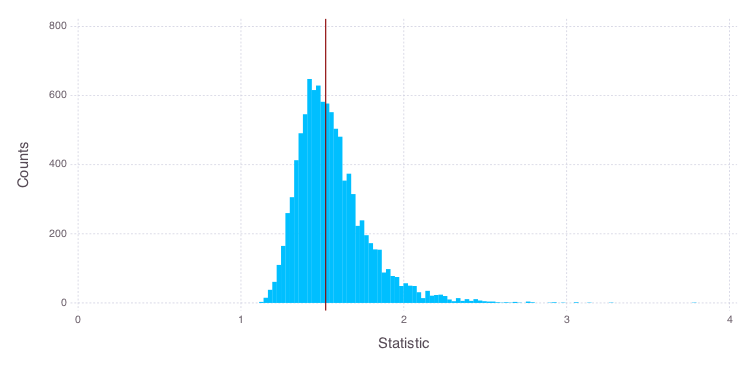

# Analysis of the City Dataset

We will explore some concepts of the statistical bootstrapping with basic examples.


```julia
using Bootstrap
```


```julia
srand(42);
```

## City Dataset

Let's have a look at the *city* dataset. This measured the population (in thousands of inhabitants) of major US cities in 1920 (column `U`) and 1930 (column `X`).


```julia
using DataFrames
using Bootstrap.Datasets
```


```julia
city
```


<table class="data-frame"><tr><th></th><th>U</th><th>X</th></tr><tr><th>1</th><td>138</td><td>143</td></tr><tr><th>2</th><td>93</td><td>104</td></tr><tr><th>3</th><td>61</td><td>69</td></tr><tr><th>4</th><td>179</td><td>260</td></tr><tr><th>5</th><td>48</td><td>75</td></tr><tr><th>6</th><td>37</td><td>63</td></tr><tr><th>7</th><td>29</td><td>50</td></tr><tr><th>8</th><td>23</td><td>48</td></tr><tr><th>9</th><td>30</td><td>111</td></tr><tr><th>10</th><td>2</td><td>50</td></tr></table>


We want to estimate the relative change of the population. An obvious approach for this is to compute the ratios of the average population between the two time points.


```julia
city_ratio(df::AbstractDataFrame) = mean(df[:,:X]) ./ mean(df[:,:U])
```


    city_ratio (generic function with 1 method)


The point estimate yields a relative change of ~1.52. We will use different bootstrap approaches to compute confidence intervals for the point estimate.


```julia
city_ratio(city)
```


    1.5203125


## Bootstrap Estimates of Relative Growth

Here, we will start with three commonly used bootstrapping techniques: The ordinary, the first-order balanced and the exact bootstrap.


```julia
bs1 = bootstrap(city, city_ratio, BasicSampling(10000))
```


    Bootstrap Sampling
      Estimates:
        │ Var │ Estimate │ Bias      │ StdError │
        ├─────┼──────────┼───────────┼──────────┤
        │ 1   │ 1.52031  │ 0.0385926 │ 0.219192 │
      Sampling: BasicSampling
      Samples:  10000
      Data:     DataFrames.DataFrame: { 10 × 2 }


```julia
bs2 = bootstrap(city, city_ratio, BalancedSampling(10000))
```


    Bootstrap Sampling
      Estimates:
        │ Var │ Estimate │ Bias      │ StdError │
        ├─────┼──────────┼───────────┼──────────┤
        │ 1   │ 1.52031  │ 0.0386018 │ 0.21915  │
      Sampling: BalancedSampling
      Samples:  10000
      Data:     DataFrames.DataFrame: { 10 × 2 }


```julia
bs3 = bootstrap(city, city_ratio, ExactSampling())
```


    Bootstrap Sampling
      Estimates:
        │ Var │ Estimate │ Bias      │ StdError │
        ├─────┼──────────┼───────────┼──────────┤
        │ 1   │ 1.52031  │ 0.0808941 │ 0.37132  │
      Sampling: ExactSampling
      Samples:  92378
      Data:     DataFrames.DataFrame: { 10 × 2 }


## Confidence Intervals

For the results from the balanced bootstrap, let's estimate confidence intervals for our point estimate for the relative gain.


```julia
ci(bs1, BasicConfInt())
```


    ((1.5203125,0.9375513279223897,1.7903274923259267),)


```julia
ci(bs1, BCaConfInt())
```


    ((1.5203125,1.2431372379737544,2.0611078530154634),)


```julia
ci(bs1, BCaConfInt(0.99))
```


    ((1.5203125,1.1799330508291126,2.3712308534772224),)


```julia
ci(bs1, NormalConfInt())
```


    ((1.5203125,1.0521117124037642,1.9113281258268937),)


```julia
ci(bs1, PercentileConfInt())
```


    ((1.5203125,1.2502975076740732,2.10307367207761),)


## Visualization

Finally, we visualize the distribution of the bootstrapped estimates $t_{1}$ together with the naive estimate $t_{0}$.


```julia
using Gadfly
```


```julia
p = plot(
    layer(xintercept = [original(bs1)[1]], Geom.vline(color = colorant"darkred")),
    layer(x = straps(bs1)[1], Geom.histogram(bincount = 100)),
    Guide.xlabel("Statistic"), Guide.ylabel("Counts")
    )
draw(PNG(20cm, 10cm), p)
```




